# ⚡ Quintile

> A high-fidelity, client-side QR generator built for absolute privacy, customizability, and high-contrast marketing wrappers. 

Standard QR generators output uninspired, rigid blocks. **Quintile** upgrades boring qrs into bespoke art using micro-topologies, fluid vectors, and independent gradient rendering.

## 🛠️ Core Capabilities

* **Topologies:** Break free from standard squares. Render your data matrix using `dots`, `rounded`, `extra-rounded`, `classy`, or `classy-rounded` interpolation styles.
* **Gradient:** Independently bind multi-stop `linear` or `radial` gradients across three distinct rendering layers: Matrix Dots, Corner Squares, and Corner Dots.
* **Marketing Frames:** Inject Tailwind-powered high-contrast perimeter frames (`Solid Lower Label Block` or `Floating Perimeter Outline`) with dynamic text strings and isolated color controllers.
* **Logos:** Seamlessly drop your brand mark into the core of the vector matrix with custom width, height, and perfect error-correction safety margins.
* **Zero Telemetry:** Compiled entirely client-side. Your inputs, payloads, and logos never cross a wire or touch an external API.


## 🎛️ Architecture & Spec

The configuration matrix is driven by a highly structured TypeScript interface designed to give pixel-perfect control to the frontend renderer.

```typescript
export interface QRCodeOptions {
  shape: "square" | "circle";
  size: number;
  margin: number;
  errorCorrectionLevel: "L" | "M" | "Q" | "H";
  includeMargin: boolean;
  
  // Isolated Vector Style Layers
  dotStyle: "square" | "dots" | "rounded" | "extra-rounded" | "classy" | "classy-rounded";
  cornerSquareStyle: "square" | "dot" | "extra-rounded";
  cornerDotStyle: "square" | "dot";

  // Multi-Channel Color/Gradient Engines
  dotsColorMode: "single" | "gradient";
  dotsGradient: QRGradient;
  cornerSquareColorMode: "single" | "gradient";
  cornerSquareGradient: QRGradient;
  
  // Outer Call-To-Action Envelope
  frameStyle: "none" | "bottom-text" | "outline";
  frameText?: string;
  frameColor?: string;
}
```


## 📦 Tech Stack 

* **Framework:** React 18 (Client-Side State Engine)
* **Styling:** Tailwind CSS (Stark Dark/Light Mode Interface)
* **Animation Layer:** Framer Motion (Fluid UI transitions and panel shifts)
* **Vector Capture:** `html-to-image` + HTML5 Canvas (High-resolution pixel-multiplying export to capture composite frame wrappers seamlessly)


## 📡 Composite Frame Capture

To bypass standard HTML5 canvas limitations that discard outer Tailwind wrappers during download, Quintile uses a 3x pixel-ratio rasterization cluster via `html-to-image`:

```javascript
const downloadQRCode = async () => {
  if (!exportRef.current) return;
  
  // Compiles canvas vector + external Tailwind frame wrappers into a single crisp PNG
  const dataUrl = await htmlToImage.toPng(exportRef.current, { pixelRatio: 3 });
  
  const link = document.createElement("a");
  link.download = `quintile-qr-${Date.now()}.png`;
  link.href = dataUrl;
  link.click();
};

```

Here is an updated version of the README. It preserves that premium, high-performance aesthetic but injects a proud **"Genesis Project"** origin story, practical real-world use cases (so people understand *why* it exists), and a friendly, reflective developer log.


## 🚀 The Genesis Story (Project #1)

Every developer has a definitive point of origin. **Quintile is, was, and will be my very first real-world software project.** 

It started as a simple exploration of how data maps to visual grids, and evolved into a full-scale obsession with vector UI, mathematical color syncing, and client-side performance. Building this taught me how to manage complex component states, handle file systems in the browser, and manipulate SVGs dynamically. It's raw, it's fast, and it represents the first step in my engineering journey.


## 🧠 What I Learned Building This

1. **State Synchronization:** Handling inputs that simultaneously update an underlying math matrix, visual colors, and text states without lagging the UI.
2. **The DOM isn't Canvas:** Learning how browsers handle SVGs vs. standard HTML divs, and engineering a bypass to export them together as a unified image.
3. **Refactoring is King:** Cleaning up chaotic, split color-pickers into a "Unified" system taught me that good UX means writing smarter code under the hood.


<br/>
<br/>

> **Built by [CoderSilicon](https://github.com/CoderSilicon)** > *It is always better to differ from others.*